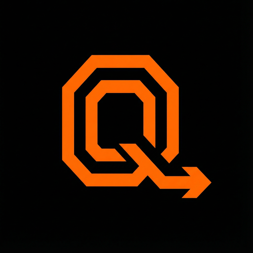
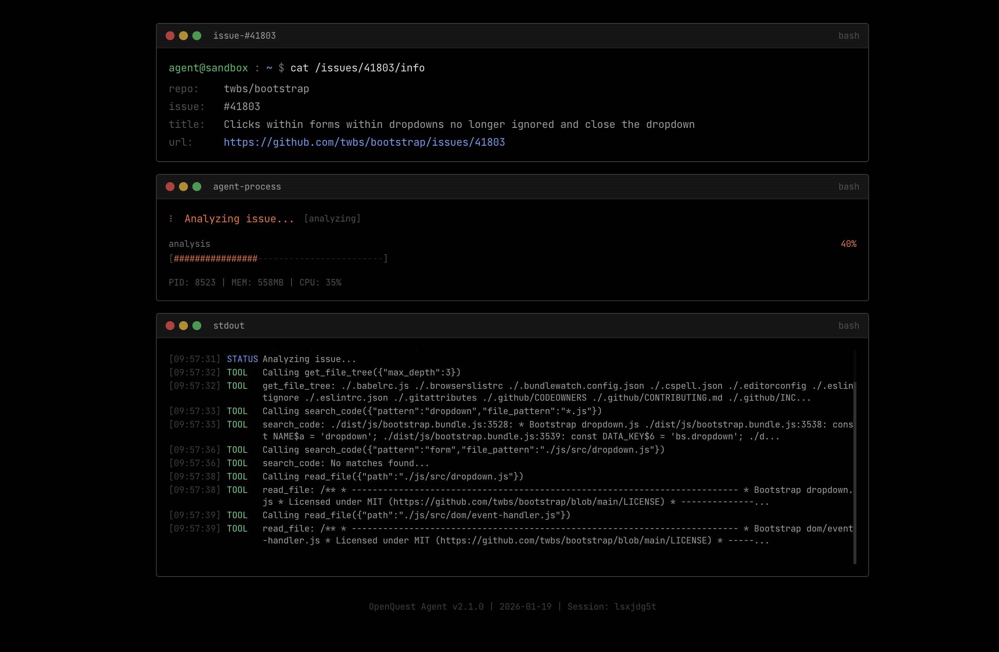

<p align="center">
  
</p>

<h1 align="center">OpenQuest</h1>

<p align="center">
  <strong>Contribute. Intelligently.</strong>
</p>

The agentic workflow platform for open source contributions. Find issues matched to your skills, get AI-powered solutions, submit PRs — all automated.

## Demo

<p align="center">
  
</p>

## What makes it different

**Agentic** — AI analyzes issues and proposes code changes in real-time
**Personalized** — Matches repositories to your skill level and interests
**Gamified** — Level up, earn badges, track your contribution journey
**Secure** — Code runs in isolated E2B sandboxes, never on your machine

## For developers who want to contribute

```
1. Set your skills     →  Python, React, TypeScript
2. Get matched         →  Beginner-friendly repos & issues
3. Let AI analyze      →  Agent explores codebase, proposes fix
4. Review & submit     →  One-click PR creation
5. Level up            →  Earn XP, unlock harder challenges
```

**Simple workflow. Real contributions.**

## Quick Start

### Frontend

```bash
cd frontend
npm install
npm run dev
```

Frontend available at http://localhost:5173

### Backend

```bash
cd backend
uv sync
uv run uvicorn app.main:app --reload
```

Backend API available at http://localhost:8000

## Environment Variables

```bash
# Backend (.env)
GITHUB_CLIENT_ID=xxx
GITHUB_CLIENT_SECRET=xxx
E2B_API_KEY=xxx
ANTHROPIC_API_KEY=xxx
SUPABASE_URL=xxx
SUPABASE_SERVICE_KEY=xxx

# Frontend (.env)
VITE_API_URL=http://localhost:8000
VITE_GITHUB_CLIENT_ID=xxx
```

## How It Works

```
┌─────────────┐     ┌─────────────┐     ┌─────────────┐     ┌─────────────┐
│   Profile   │ ──▶ │    Match    │ ──▶ │   Analyze   │ ──▶ │ Contribute  │
│             │     │             │     │             │     │             │
│ Set skills  │     │ AI matches  │     │ Agent reads │     │ Create PR   │
│ & interests │     │ repos/issues│     │ & proposes  │     │ & level up  │
└─────────────┘     └─────────────┘     └─────────────┘     └─────────────┘
```

## Tech Stack

| Layer | Technologies |
|-------|-------------|
| Frontend | React, TypeScript, Vite, Tailwind CSS, Zustand |
| Backend | FastAPI, Python, Anthropic Claude |
| Sandbox | E2B (isolated code execution) |
| Database | Supabase (PostgreSQL) |
| Auth | GitHub OAuth |

## Architecture

```
Frontend (React)
     │
     │ WebSocket / REST
     ▼
Backend (FastAPI)
     │
     ├──▶ Claude API (AI reasoning)
     │
     └──▶ E2B Sandbox (git clone, code analysis, PR creation)
              │
              └──▶ GitHub API (push, create PR)
```

---

**OpenQuest** — Your AI copilot for open source.

## License

MIT
